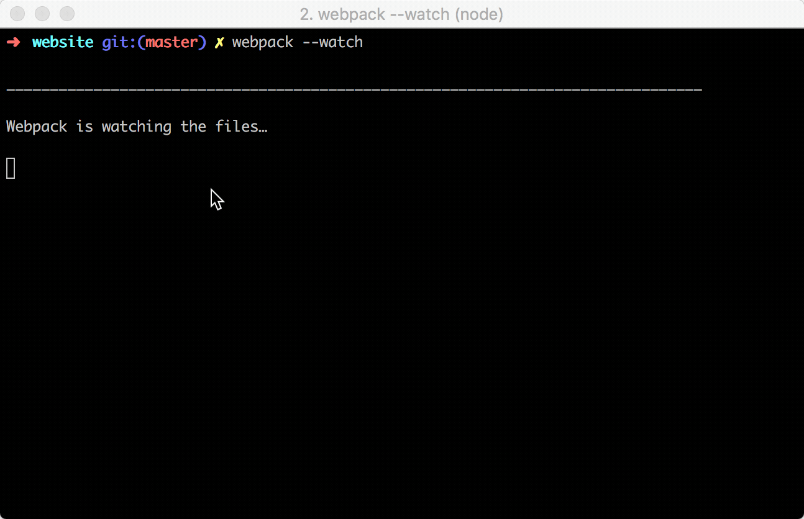

# print-time-webpack

This is a simple plugin that adds an underscore separator and appends a timestamp 
to the end of your webpack watch builds. This will give you an indication when 
the build has completed.



## Install

``` bash
npm install --save-dev print-time-webpack
```

## Usage

``` javascript
const PrintTimeWebpackPlugin = require('print-time-webpack');

module.exports = {
 
  plugins: [ 
    new PrintTimeWebpackPlugin() 
  ]
 
};

```
